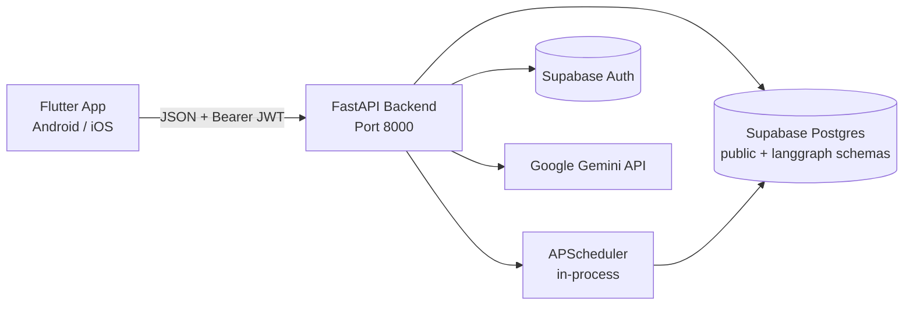

# EZ — Life Made EZ

EZ is an AI-powered, multilingual home services booking platform designed to connect users in Pakistan (specifically starting in Islamabad) with local service providers (plumbers, electricians, AC repair, tutors, beauticians, cleaners) through a seamless conversational experience. 

The application consists of a **FastAPI backend** running a custom LangGraph agent workflow backed by Google Gemini, a **Flutter mobile frontend**, and **Supabase** for database, auth, and state persistence.

---

## System Architecture

EZ is designed as an agentic client-server application. Below is the system flow and components:

### Components

1. **Flutter Mobile Frontend**: 
   - Uses a rich, custom design system utilizing premium color palettes (yellow, cream, white, and ink).
   - Provides a conversational chat interface with voice recording and translation capabilities.
   - Leverages `flutter_animate` for high-fidelity micro-interactions (e.g., staggered landing screen, custom logo bounce, fading exit transitions).
   
2. **FastAPI Backend Server**:
   - Manages user sessions, authentication validation, and API routing.
   - Hosts the LangGraph state machine agent for service discovery and booking.
   - Incorporates `APScheduler` for managing booking reminders and follow-up notifications.

3. **Supabase Core**:
   - **Postgres Database**: Stores service providers, user profiles, bookings, agent traces, and notification templates.
   - **Checkpointer**: Implements Postgres-backed state checkpointers for LangGraph conversations (`PostgresSaver`) allowing multi-turn discussions to persist seamlessly.

---

## Agent Orchestration (LangGraph Flow)

The heart of EZ's service routing is a deterministic LangGraph StateGraph agent. Rather than using an unconstrained ReAct loop, the agent relies on structured nodes to parse user intent, search for providers, resolve ambiguity, and finalize bookings.

Below is the orchestration path:

### Agent Graph Nodes

* **`intent_parser`**: Extracts fields (`service_type`, `area`, `scheduled_at`) using structural JSON outputs from Google Gemini. Supports multilingual inputs (English, Urdu, and Romanized Urdu).
* **`clarifier`**: If essential details are missing, pauses execution by calling `interrupt()` to prompt the user. State is saved via the Postgres Checkpointer using `conversation_id` as the thread key.
* **`provider_discovery`**: Executes specialized tools (`find_providers` and `find_available_areas`) against the Supabase database.
* **`ranking`**: Sorts candidates based on geographical distance, service rating, and availability.
* **`decision`**: Formulates a booking plan or prompts further clarification if ambiguity remains.
* **`booking_step` & `followup_step`**: Creates booking transactions in the DB and schedules notification jobs.

---

## How Antigravity is Used

**Antigravity** acted as a pair programmer throughout the development lifecycle of this project. Below are the key contributions:

1. **Splash Screen Overhaul**: Redesigned the splash screen based on CSS designs, utilizing `flutter_animate` for a polished entry sequence, while resolving a critical white-flash bug on exit by decoupling the opacity animation from the background gradient.
2. **Interactive UI Enhancements**: Implemented key interactive elements on the home screen, including a custom typing animation to the `"Apko konsi service chahiyay?"` placeholder search prompt with a self-destructing blinking cursor to avoid UI clutter.
3. **Session & Auth Lifecycles**: Standardized auth token handling inside `ApiService`, ensuring session states auto-expire and clear on backend `401 Unauthorized` responses to seamlessly redirect users to the Auth flow.
4. **Backend/Frontend Alignment**: Debugged and stabilized network boundaries to ensure that physical Android devices could reach the backend FastAPI server across the Windows network boundary.
5. **Agent Trace Consolidation**: Collected and exported all planning artifacts, task check-lists, and technical walkthroughs into a structured repository under `/agent_traces/` to provide clear visibility for hackathon evaluators.

---

## APIs & Tools Used

### Backend & AI
* **Google Gemini API (`gemini-2.5-flash`)**: Core LLM driving intent parsing, conversation clarification, and ranking decisions.
* **LangGraph (LangChain)**: Orchestrates the multi-step state graph.
* **FastAPI**: Lightweight ASGI web framework for fast API route rendering.
* **Supabase**: Backend database hosting Postgres schema, thread state saver, and auth.
* **APScheduler**: In-memory job scheduler triggering async notifications.

### Frontend
* **Flutter SDK (Dart)**: Cross-platform mobile development framework.
* **Google Fonts (Plus Jakarta Sans / Outfit)**: Brand typography.
* **Flutter Animate**: Declarative library for custom animations.
* **Record & Path Provider**: Voice capture and transcription pre-processing tools.

---

## Assumptions & Limitations

### Assumptions
* **Geographical Scope**: Evaluated location logic assumes services are searched for within Islamabad sub-sectors (e.g., G-13, F-11, E-11).
* **Network Connectivity**: The frontend client expects the server to be hosted on a local area network or a static IP tunnel.
* **Language Handling**: The LLM assumes users converse in standard English, formal Urdu, or romanized Urdu (e.g., "AC kharab hai fix krdo").

### Limitations
* **Voice Transcription Boundary**: The voice module requires a microphone-capable physical device or simulator and maps audio formats directly.
* **Timezone Synchronization**: Database timestamps default to UTC, requiring the client to handle local offset conversions for precise booking schedules.
* **Local Emulator Firewalling**: Running the FastAPI server on Windows requires explicit firewall permissions or tunneling (e.g. ngrok/Localtunnel) for a physical mobile phone to make API connections.

---

## Agent Traces (Submission Directory)

All planning steps, walkthroughs, and checklists created by the Antigravity assistant during the course of the project can be reviewed under the `/agent_traces` directory in the root of this project.

* Location: `./agent_traces/`
* Format: `<conversation-id>_implementation_plan.md` & `<conversation-id>_walkthrough.md`
