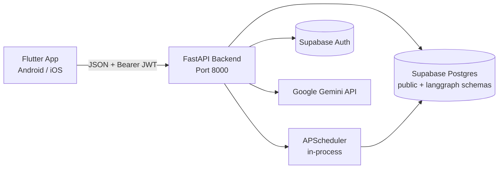
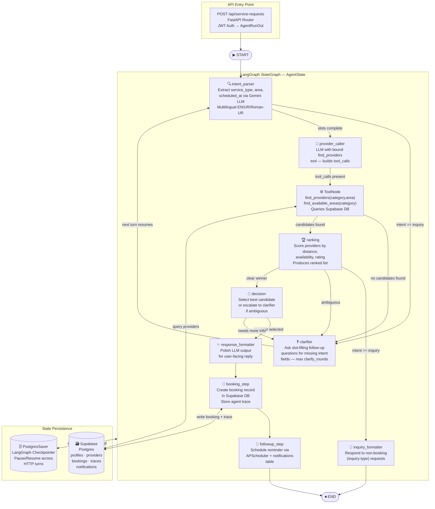

# EZ — Life Made EZ

EZ is an AI-powered, multilingual home services booking platform designed to connect users in Pakistan (specifically starting in Islamabad) with local service providers (plumbers, electricians, AC repair, tutors, beauticians, cleaners) through a seamless conversational experience. 

The application consists of a **FastAPI backend** running a custom LangGraph agent workflow backed by Google Gemini, a **Flutter mobile frontend**, and **Supabase** for database, auth, and state persistence.

---

## System Architecture

EZ is designed as an agentic client-server application. Below is the system flow and components:



### Components

1. **Flutter Mobile Frontend**: 
   - Uses a rich, custom design system utilizing premium color palettes (yellow, cream, white, and ink).
   - Provides a conversational chat interface with voice recording and translation capabilities.
   - Leverages `flutter_animate` for high-fidelity micro-interactions (e.g., staggered landing screen, custom logo bounce, fading exit transitions).
   
2. **FastAPI Backend Server**:
   - Manages user sessions, authentication validation, and API routing.
   - Hosts the LangGraph state machine agent for service discovery and booking.
   - Incorporates `APScheduler` for managing booking reminders and follow-up notifications.

3. **Supabase Core**:
   - **Postgres Database**: Stores service providers, user profiles, bookings, agent traces, and notification templates.
   - **Checkpointer**: Implements Postgres-backed state checkpointers for LangGraph conversations (`PostgresSaver`) allowing multi-turn discussions to persist seamlessly.

---

## Agent Orchestration (LangGraph Flow)

The heart of EZ's service routing is a deterministic LangGraph StateGraph agent. Rather than using an unconstrained ReAct loop, the agent relies on structured nodes to parse user intent, search for providers, resolve ambiguity, and finalize bookings.

Below is the orchestration path:



### Agent Graph Nodes

* **`intent_parser`**: Extracts fields (`service_type`, `area`, `scheduled_at`) using structural JSON outputs from Google Gemini. Supports multilingual inputs (English, Urdu, and Romanized Urdu).
* **`clarifier`**: If essential details are missing, pauses execution by calling `interrupt()` to prompt the user. State is saved via the Postgres Checkpointer using `conversation_id` as the thread key.
* **`provider_discovery`**: Executes specialized tools (`find_providers` and `find_available_areas`) against the Supabase database.
* **`ranking`**: Sorts candidates based on geographical distance, service rating, and availability.
* **`decision`**: Formulates a booking plan or prompts further clarification if ambiguity remains.
* **`booking_step` & `followup_step`**: Creates booking transactions in the DB and schedules notification jobs.

---

## How Antigravity is Used

**Antigravity** acted as a pair programmer throughout the development lifecycle of this project. Below are the key contributions:

1. **Splash Screen Overhaul**: Redesigned the splash screen based on CSS designs, utilizing `flutter_animate` for a polished entry sequence, while resolving a critical white-flash bug on exit by decoupling the opacity animation from the background gradient.
2. **Interactive UI Enhancements**: Implemented key interactive elements on the home screen, including a custom typing animation to the `"Apko konsi service chahiyay?"` placeholder search prompt with a self-destructing blinking cursor to avoid UI clutter.
3. **Session & Auth Lifecycles**: Standardized auth token handling inside `ApiService`, ensuring session states auto-expire and clear on backend `401 Unauthorized` responses to seamlessly redirect users to the Auth flow.
4. **Backend/Frontend Alignment**: Debugged and stabilized network boundaries to ensure that physical Android devices could reach the backend FastAPI server across the Windows network boundary.
5. **Agent Trace Consolidation**: Collected and exported all planning artifacts, task check-lists, and technical walkthroughs into a structured repository under `/agent_traces/` to provide clear visibility for hackathon evaluators.

---

## APIs & Tools Used

### Backend & AI
* **Google Gemini API (`gemini-2.5-flash`)**: Core LLM driving intent parsing, conversation clarification, and ranking decisions.
* **LangGraph (LangChain)**: Orchestrates the multi-step state graph.
* **FastAPI**: Lightweight ASGI web framework for fast API route rendering.
* **Supabase**: Backend database hosting Postgres schema, thread state saver, and auth.
* **APScheduler**: In-memory job scheduler triggering async notifications.

### Frontend
* **Flutter SDK (Dart)**: Cross-platform mobile development framework.
* **Google Fonts (Plus Jakarta Sans / Outfit)**: Brand typography.
* **Flutter Animate**: Declarative library for custom animations.
* **Record & Path Provider**: Voice capture and transcription pre-processing tools.

---

## Assumptions & Limitations

### Assumptions
* **Geographical Scope**: Evaluated location logic assumes services are searched for within Islamabad sub-sectors (e.g., G-13, F-11, E-11).
* **Network Connectivity**: The frontend client expects the server to be hosted on a local area network or a static IP tunnel.
* **Language Handling**: The LLM assumes users converse in standard English, formal Urdu, or romanized Urdu (e.g., "AC kharab hai fix krdo").

### Limitations
* **Voice Transcription Boundary**: The voice module requires a microphone-capable physical device or simulator and maps audio formats directly.
* **Timezone Synchronization**: Database timestamps default to UTC, requiring the client to handle local offset conversions for precise booking schedules.
* **Local Emulator Firewalling**: Running the FastAPI server on Windows requires explicit firewall permissions or tunneling (e.g. ngrok/Localtunnel) for a physical mobile phone to make API connections.

---

## Notifications & Reminder Scheduler

EZ implements a fully in-process, crash-recoverable notification pipeline using **APScheduler** (BackgroundScheduler) paired with a `notifications` table in Supabase Postgres.

### How It Works

```
booking_step  ──►  followup_step  ──►  insert_notification (Supabase)
                                            │
                                            ▼
                                   schedule_reminder()
                                   (APScheduler "date" job)
                                            │
                                     [fires at remind_at]
                                            │
                                            ▼
                               dispatch_notification()
                               mark_notification_sent()  ──►  Supabase update
```

1. **`followup_step`** (`app/agents/nodes.py`) — Runs immediately after a booking is confirmed. It calculates `remind_at` (1 hour before the appointment, or `demo_offset_seconds` from now for live demos) and persists a row to the `notifications` table via `T.insert_notification`.

2. **`schedule_reminder()`** (`app/scheduler/runtime.py`) — Registers a one-shot APScheduler `date` job keyed by `notif:<notification_id>`. The `misfire_grace_time` is set to 3 600 s (one hour) so a brief server restart will not silently drop a reminder that fired while the process was down.

3. **`dispatch_notification()`** (`app/scheduler/jobs.py`) — Called by APScheduler at `remind_at`. Currently logs the reminder and calls `mark_notification_sent()` to stamp the `sent_at` column in Supabase (simulating a push notification). In production this hook is where FCM / APNs / SMS delivery would be wired in.

4. **Crash recovery — `requeue_due_notifications()`** (`app/scheduler/jobs.py`) — Called once during `start_scheduler()` at process boot. It queries the DB for all unsent notifications whose `scheduled_at` is in the future and re-registers them as APScheduler jobs, ensuring no reminders are lost after a process restart or container redeploy.

5. **Slot-hold expiry — `expire_holds_job()`** — Runs every 30 seconds to sweep booking rows stuck in `held` status (e.g., abandoned mid-flow), freeing the slot for other users.

### Notifications Table Schema

```sql
-- From supabase/migrations/001_init.sql
CREATE TABLE notifications (
    id           UUID PRIMARY KEY DEFAULT gen_random_uuid(),
    booking_id   UUID REFERENCES bookings(id) ON DELETE CASCADE,
    kind         TEXT NOT NULL,            -- 'reminder' | 'confirmation' | etc.
    scheduled_at TIMESTAMPTZ NOT NULL,     -- when the job should fire
    sent_at      TIMESTAMPTZ,              -- NULL until dispatched
    payload      JSONB                     -- { message, booking_id, ... }
);
```

### Demo Mode

Pass `demo_offset_seconds=30` in the `/api/service-requests` request body to have the reminder fire 30 seconds after booking — useful for live hackathon demos:

```json
{
  "text": "plumber chahiye G-11 mein kal 3 baje",
  "demo_offset_seconds": 30
}
```

---

## Local Development Setup

### Prerequisites

| Tool | Version |
|------|---------|
| Python | 3.11+ |
| Flutter SDK | 3.x |
| Supabase project | any region |
| Google Gemini API key | `gemini-2.5-flash` model |

### 1. Clone & Configure Environment

```powershell
git clone <repo-url>
cd ez_app/backend

# Copy and fill in the template
copy .env.example .env
```

Required environment variables in `backend/.env`:

| Variable | Description |
|---|---|
| `SUPABASE_URL` | Your Supabase project URL (`https://<ref>.supabase.co`) |
| `SUPABASE_ANON_KEY` | Supabase anonymous/public key |
| `SUPABASE_SERVICE_KEY` | Supabase service-role key (bypasses RLS for backend writes) |
| `SUPABASE_DB_URL` | Direct Postgres URI for LangGraph's PostgresSaver checkpointer |
| `GEMINI_API_KEY` | Google Gemini API key |
| `GEMINI_MODEL` | Model name (default: `gemini-2.5-flash`) |
| `GOOGLE_PLACES_API_KEY` | Used by provider seeding script |
| `APP_HOST` | `0.0.0.0` |
| `APP_PORT` | `8000` |
| `FRONTEND_ORIGIN` | IP/hostname the Flutter app connects from (for CORS) |

### 2. Database Migrations

Run migrations **in order** from the Supabase SQL editor (Dashboard → SQL Editor):

```
supabase/migrations/001_init.sql          ← Core tables: profiles, providers, bookings, notifications, agent_traces
supabase/migrations/002_conflict_prevention.sql  ← Booking conflict-prevention triggers
supabase/migrations/003_agent_features.sql       ← Waitlist, price ranges
supabase/migrations/004_agent_features_part2.sql ← Free-slots, holds, user-profile extras
```

### 3. Install & Run Backend

```powershell
cd backend
python -m venv .venv
.venv\Scripts\Activate.ps1
pip install -r requirements.txt

# Seed provider data (Islamabad, 5 service categories)
python -m scripts.seed_providers

# Start dev server with hot-reload
uvicorn app.main:app --reload --port 8000
```

The API will be available at `http://localhost:8000`.  
Interactive docs: `http://localhost:8000/api/docs`

### 4. Run Flutter Frontend

```powershell
cd frontend
flutter pub get
flutter run
```

> **Physical device on Windows**: The Flutter app targets the machine's LAN IP, not `localhost`. Make sure to set `FRONTEND_ORIGIN` in `.env` to match your machine's IP (e.g. `http://192.168.x.x:8000`) and allow port 8000 through the Windows Firewall, or use an ngrok/Localtunnel tunnel.

---

## Deployment

### Docker (Backend)

The backend ships with a `Dockerfile` at `backend/Dockerfile` configured for **Google Cloud Run** (but compatible with any container host).

```powershell
# Build the image from the backend directory
cd backend
docker build -t ez-backend .

# Run locally (mirrors Cloud Run behaviour)
docker run --env-file .env -p 8080:8080 ez-backend
```

The container starts uvicorn on `$PORT` (injected at runtime by Cloud Run; defaults to `8080`):

```dockerfile
ENV PORT=8080
CMD ["sh", "-c", "uvicorn app.main:app --host 0.0.0.0 --port ${PORT}"]
```

### Google Cloud Run

```bash
# Authenticate and set project
gcloud auth login
gcloud config set project <your-gcp-project>

# Build & push via Cloud Build
gcloud builds submit --tag gcr.io/<your-gcp-project>/ez-backend ./backend

# Deploy to Cloud Run (set all env vars as secrets or --set-env-vars)
gcloud run deploy ez-backend \
  --image gcr.io/<your-gcp-project>/ez-backend \
  --platform managed \
  --region asia-south1 \
  --allow-unauthenticated \
  --set-env-vars "SUPABASE_URL=...,SUPABASE_ANON_KEY=...,GEMINI_API_KEY=..."
```

> **Important**: APScheduler runs **in-process** in a background thread. Cloud Run scales to zero by default, which will terminate all in-memory scheduled jobs. To keep reminders reliable in production:
> - Set **minimum instances = 1** (`--min-instances 1`) in Cloud Run, **or**
> - Replace APScheduler with a durable queue (e.g., Cloud Tasks, Google Pub/Sub) for production workloads.

### Flutter Mobile Build

```powershell
cd frontend

# Android APK (debug)
flutter build apk --debug

# Android APK (release — requires keystore configuration)
flutter build apk --release

# iOS (requires macOS + Xcode)
flutter build ios --release
```

Point the app's base URL constant to your deployed Cloud Run service URL before building for release.

---

## Agent Traces (Submission Directory)

All planning steps, walkthroughs, and checklists created by the Antigravity assistant during the course of the project can be reviewed under the `/agent_traces` directory in the root of this project.

* Location: `./agent_traces/`
* Format: `<conversation-id>_implementation_plan.md` & `<conversation-id>_walkthrough.md`
