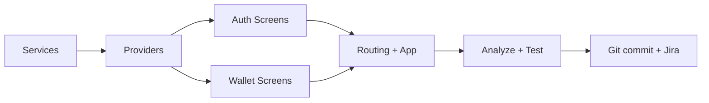

# Sprint 1 — Authentication & Wallet

Sprint 1 implements the full onboarding flow (registration → OTP → biometric → PIN → login) and the wallet dashboard with transaction history. This is the largest Sprint with **7 stories** and **18 subtasks** across two epics.

## Jira Coverage

| Epic | Story | Key | Subtask Count |
|------|-------|-----|---------------|
| Authentication & Onboarding (SCRUM-6) | CNIC-based registration | SCRUM-28 | 3 (SCRUM-32, 33, 34) |
| | Mock OTP verification | SCRUM-29 | 3 (SCRUM-35, 36, 37) |
| | Biometric verification | SCRUM-30 | 2 (SCRUM-38, 39) |
| | Secure PIN creation & login | SCRUM-31 | 3 (SCRUM-40, 41, 42) |
| Wallet Management (SCRUM-7) | Wallet dashboard with PKR balance | SCRUM-43 | 2 (SCRUM-46, 47) |
| | Transaction history with search/filter | SCRUM-44 | 3 (SCRUM-48, 49, 50) |
| | In-app transaction receipt | SCRUM-45 | 2 (SCRUM-51, 52) |

---

## Proposed Changes

### 1. Provider Layer (State Management)

New `ChangeNotifier` classes that expose reactive state to the UI.

#### [NEW] `lib/features/auth/providers/auth_provider.dart`
- Wraps `AuthService` + `WalletService`
- Exposes: `currentUser`, `isLoading`, `error`, `otpSent`, `otpVerified`, `isLoggedIn`
- Methods: `register()`, `sendOtp()`, `verifyOtp()`, `createPin()`, `verifyPin()`, `authenticateWithBiometrics()`, `logout()`
- On successful registration: auto-creates wallet with Rs 25,000 seed balance

#### [NEW] `lib/features/wallet/providers/wallet_provider.dart`
- Wraps `WalletService` + `TransactionService`
- Exposes: `wallet`, `transactions`, `isLoading`, `hasMore`, `activeFilter`
- Methods: `loadWallet()`, `loadTransactions()`, `loadMore()`, `search()`, `filterByType()`

---

### 2. Service Layer (Backend Logic)

#### [MODIFY] [auth_service.dart](file:///c:/Users/Sana%20Mir/Documents/SANA_UNI/Semester8/SPM/Project/Finora-App/lib/data/services/auth_service.dart)
Replace all `UnimplementedError` stubs with working implementations:
- `register()` → validate CNIC/phone uniqueness, insert into `users` table, return `User`
- `sendOtp()` → generate random 6-digit OTP, store in-memory with 60s expiry timer
- `verifyOtp()` → compare OTP, enforce 3-attempt lockout
- `createPin()` → SHA-256 hash with random salt, persist via `flutter_secure_storage`
- `verifyPin()` → hash input, compare against stored hash
- `authenticateWithBiometrics()` → call `local_auth` plugin
- `setBiometricEnabled()` → update user record in DB
- `getCurrentUser()` → read userId from secure storage, query DB
- `logout()` → clear secure storage session key

#### [MODIFY] [wallet_service.dart](file:///c:/Users/Sana%20Mir/Documents/SANA_UNI/Semester8/SPM/Project/Finora-App/lib/data/services/wallet_service.dart)
- `getWallet()` → query wallets table by userId
- `createWallet()` → insert with UUID, initial balance, timestamp
- `updateBalance()` → atomic read + update with balance check

#### [MODIFY] [transaction_service.dart](file:///c:/Users/Sana%20Mir/Documents/SANA_UNI/Semester8/SPM/Project/Finora-App/lib/data/services/transaction_service.dart)
- `getTransactions()` → paginated query with type/date filters
- `searchTransactions()` → LIKE query on recipient_name/description

---

### 3. Auth Screens (Onboarding Flow)

All screens follow the dark-mode Finora aesthetic with `flutter_animate` entrance animations.

#### [NEW] `lib/features/auth/screens/onboarding_screen.dart`
- 3-page PageView with illustrations (gradient shapes), headline, and subtitle
- Progress dots indicator, "Get Started" CTA on last page
- Staggered fade-in + slide animations

#### [NEW] `lib/features/auth/screens/register_screen.dart`
- Full-name, CNIC (with auto-dash formatting), and phone fields
- Real-time validation using `Validators`
- `PrimaryButton` with loading spinner
- Error states with shake animation

#### [NEW] `lib/features/auth/screens/otp_screen.dart`
- 6-cell OTP input with auto-advance between fields
- 60-second countdown timer for resend
- Mock OTP displayed as a snackbar (dev convenience)
- Lockout after 3 failed attempts

#### [NEW] `lib/features/auth/screens/biometric_setup_screen.dart`
- Fingerprint illustration with glowing animation
- "Enable Biometric" CTA, "Skip for now" text button
- Calls `local_auth` to test hardware availability
- Graceful fallback if no sensor

#### [NEW] `lib/features/auth/screens/pin_setup_screen.dart`
- Reuses Sprint 0's `PinPad` widget
- Two-phase: Create PIN → Confirm PIN
- Mismatch triggers shake animation + error state
- Success animates to dashboard

#### [NEW] `lib/features/auth/screens/login_screen.dart`
- PinPad for PIN entry
- Biometric button if enabled
- "Forgot PIN?" link (just shows info dialog for prototype)
- 3-attempt lockout

---

### 4. Wallet Screens (Dashboard & History)

#### [NEW] `lib/features/wallet/screens/home_screen.dart`
- **Balance card**: gradient surface, AmountText with animated counter, eye toggle to hide balance
- **Quick actions row**: Send, Scan, Bills, Top Up (4 circular icon buttons)
- **Recent transactions**: last 5 items in a list
- Pull-to-refresh
- Shimmer loading skeleton while data loads

#### [NEW] `lib/features/wallet/screens/activity_screen.dart`
- Full transaction history with infinite scroll
- **Filter chips**: All, Sent, Received, Bills, Cards
- **Search bar** with debounced input
- Date grouping (Today, Yesterday, This Week, etc.)
- Shimmer skeleton loading

#### [NEW] `lib/features/wallet/screens/transaction_detail_screen.dart`
- Receipt-style card layout
- Icon + status badge (completed/failed/pending)
- Amount, date, recipient, description
- Reference ID at bottom
- Share button (placeholder)

---

### 5. Shared Widgets (New)

#### [NEW] `lib/shared/widgets/finora_text_field.dart`
- Themed text field with label, prefix icon, suffix, error text
- Animated focus border with indigo highlight
- CNIC auto-dash formatter as an `InputFormatter`

#### [NEW] `lib/shared/widgets/transaction_tile.dart`
- Reusable list tile for transaction history
- Icon circle (color-coded by type), title, subtitle, amount (red/green by debit/credit)

#### [NEW] `lib/shared/widgets/otp_field.dart`
- 6-cell input with auto-focus-advance
- Animated fill state

---

### 6. Routing & App Updates

#### [MODIFY] [app_router.dart](file:///c:/Users/Sana%20Mir/Documents/SANA_UNI/Semester8/SPM/Project/Finora-App/lib/core/routing/app_router.dart)
- Replace all placeholder routes for auth and wallet screens with real widgets
- Add redirect guard: if no logged-in user → `/onboarding`; if logged in → `/home`

#### [MODIFY] [app.dart](file:///c:/Users/Sana%20Mir/Documents/SANA_UNI/Semester8/SPM/Project/Finora-App/lib/app.dart)
- Wrap with `MultiProvider` providing `AuthProvider` and `WalletProvider`

#### [MODIFY] [splash_screen.dart](file:///c:/Users/Sana%20Mir/Documents/SANA_UNI/Semester8/SPM/Project/Finora-App/lib/features/auth/screens/splash_screen.dart)
- Check `AuthProvider.isLoggedIn` to route to `/home` or `/onboarding`

---

## Execution Order

1. **Services first**: Implement `AuthService`, `WalletService`, `TransactionService`
2. **Shared widgets**: `FinoraTextField`, `OtpField`, `TransactionTile`
3. **Providers**: `AuthProvider`, `WalletProvider`
4. **Auth screens**: Onboarding → Register → OTP → Biometric → PIN → Login
5. **Wallet screens**: Home → Activity → Transaction Detail
6. **Wiring**: Update router, app.dart, splash_screen
7. **Verify**: `flutter analyze`, manual review
8. **Ship**: Git commit + tag `sprint-1`, push, close all Jira tickets

---

## Verification Plan

### Automated
- `flutter analyze` — zero errors/warnings
- Full build compilation check

### Manual Flow Test (on emulator or device)
1. Cold start → Splash → Onboarding (3 pages)
2. Register with CNIC `35202-1234567-1`, phone `03001234567`, name "Test User"
3. OTP screen shows mock code → enter → advance
4. Biometric setup → enable or skip
5. PIN creation → confirm PIN → navigate to dashboard
6. Dashboard shows Rs 25,000.00 balance, quick actions, empty transaction list
7. Activity tab shows empty state with filter chips
8. Close app → reopen → login with PIN or biometric → dashboard
9. Logout → back to login

---

## Git Convention
- Branch: `main` (per project contract)
- Commit message: `feat(auth): implement registration, OTP, biometric, PIN login`
- Second commit: `feat(wallet): dashboard, transaction history, receipt view`
- Tag: `sprint-1`
