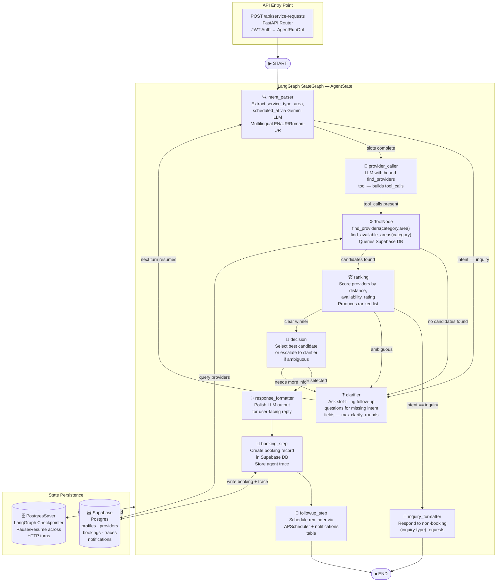

# Agent Orchestration

```mermaid
flowchart TD
    START([▶ START]) --> intent_parser

    subgraph Agent["LangGraph StateGraph — AgentState"]

        intent_parser["🔍 intent_parser\nExtract service_type, area,\nscheduled_at via Gemini LLM\nMultilingual EN/UR/Roman-UR"]

        clarifier["❓ clarifier\nAsk slot-filling follow-up\nquestions for missing intent\nfields — max clarify_rounds"]

        provider_caller["📡 provider_caller\nLLM with bound find_providers\ntool — builds tool_calls"]

        tool_executor["⚙️ ToolNode\nfind_providers(category,area)\nfind_available_areas(category)\nQueries Supabase DB"]

        ranking["🏆 ranking\nScore providers by distance,\navailability, rating\nProduces ranked list"]

        inquiry_formatter["💬 inquiry_formatter\nRespond to non-booking\n(inquiry-type) requests"]

        decision["🎯 decision\nSelect best candidate\nor escalate to clarifier\nif ambiguous"]

        response_formatter["✨ response_formatter\nPolish LLM output\nfor user-facing reply"]

        booking_step["📅 booking_step\nCreate booking record\nin Supabase DB\nStore agent trace"]

        followup_step["🔔 followup_step\nSchedule reminder via\nAPScheduler + notifications\ntable"]
    end

    END([⏹ END])

    intent_parser -->|"intent == inquiry"| clarifier
    intent_parser -->|"slots complete"| provider_caller
    clarifier -->|"next turn resumes"| intent_parser

    provider_caller -->|"tool_calls present"| tool_executor
    tool_executor -->|"no candidates found"| clarifier
    tool_executor -->|"candidates found"| ranking

    ranking -->|"intent == inquiry"| inquiry_formatter
    ranking -->|"ambiguous"| clarifier
    ranking -->|"clear winner"| decision

    inquiry_formatter --> END

    decision -->|"provider selected"| response_formatter
    decision -->|"needs more info"| clarifier

    response_formatter --> booking_step
    booking_step --> followup_step
    followup_step --> END

    subgraph Persistence["State Persistence"]
        checkpointer[("🗄️ PostgresSaver\nLangGraph Checkpointer\nPause/Resume across\nHTTP turns")]
        supabase[("🗃️ Supabase\nPostgres\nprofiles · providers\nbookings · traces\nnotifications")]
    end

    Agent <-->|"conversation_id thread"| checkpointer
    booking_step <-->|"write booking + trace"| supabase
    tool_executor <-->|"query providers"| supabase

    subgraph Entry["API Entry Point"]
        route["POST /api/service-requests\nFastAPI Router\nJWT Auth → AgentRunOut"]
    end

    route --> START
```
