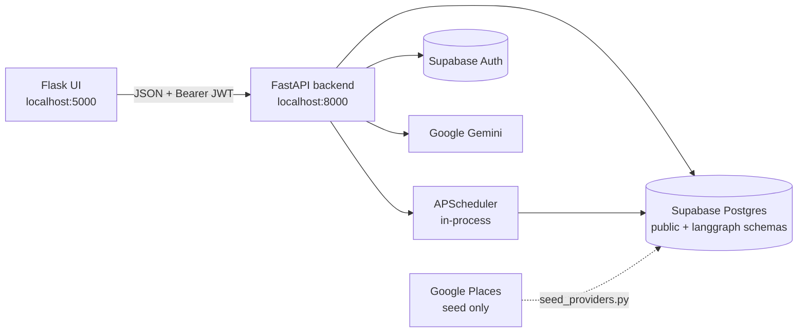
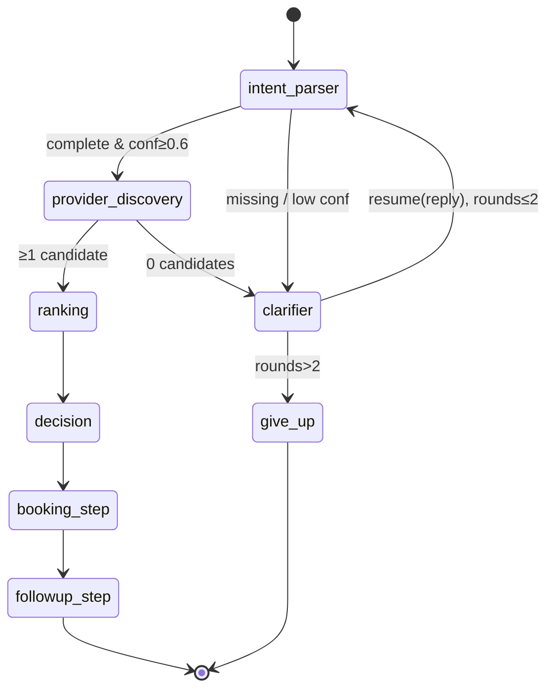

# Architecture

Three diagrams: **system context**, **agent graph**, and **request lifecycle**.
Each is given as ASCII (always renders) and Mermaid (renders on GitHub and in
most modern Markdown viewers).

---

## 1. System context

```
┌────────────────────┐        HTTPS/JSON         ┌──────────────────────────┐
│  Flask UI (5000)   │ ───────────────────────► │   FastAPI backend (8000) │
│  templates + JS    │ ◄───────────────────────  │                          │
│  JWT in localStore │                           │  ┌────────────────────┐  │
└────────────────────┘                           │  │  routers/          │  │
                                                 │  │   auth             │  │
                                                 │  │   service_requests │──┼──► LangGraph
                                                 │  │   bookings         │  │     pipeline
                                                 │  └────────────────────┘  │
                                                 │  ┌────────────────────┐  │
                                                 │  │  APScheduler       │  │
                                                 │  │  (in-process,      │  │
                                                 │  │   AsyncIO)         │  │
                                                 │  └────────────────────┘  │
                                                 └──────────────┬───────────┘
                                                                │
                  ┌─────────────────────────────────────────────┼───────────────┐
                  ▼                                             ▼               ▼
        ┌──────────────────┐                       ┌──────────────────┐  ┌────────────┐
        │  Supabase Auth   │                       │  Supabase        │  │  Google    │
        │  (email + pwd)   │                       │  Postgres        │  │  Gemini    │
        └──────────────────┘                       │  ┌────────────┐  │  │  (LLM)     │
                                                   │  │ public.*   │  │  └────────────┘
                                                   │  │ langgraph.*│  │
                                                   │  └────────────┘  │  ┌────────────┐
                                                   └──────────────────┘  │  Google    │
                                                                         │  Places    │ (seed-time only)
                                                                         └────────────┘
```



---

## 2. Agent graph (LangGraph)

```
                          ┌──────────────────┐
                          │      START       │
                          └────────┬─────────┘
                                   ▼
                         ┌───────────────────┐
                         │  intent_parser    │
                         │  (Gemini, struct) │
                         └─────┬──────┬──────┘
            complete & conf≥0.6│      │missing slot / low conf
                               ▼      ▼
                ┌─────────────────────┐    ┌──────────────────────┐
                │ provider_discovery  │    │       clarifier      │
                │ (find_providers     │    │  Gemini → question   │
                │  @tool)             │    │  interrupt()  ──► API│
                └────┬────────┬───────┘    └──────────┬───────────┘
                     │        │ 0 results              │ resume(user_reply)
                     │ ≥1     ▼                        │ rounds++
                     │        └────────────────────────┤
                     ▼                                 ▼
                ┌──────────┐                ┌──────────────────────┐
                │ ranking  │                │ if rounds>2          │
                │ (pure)   │                │   → give_up → END    │
                └────┬─────┘                │ else                 │
                     ▼                      │   → intent_parser    │
                ┌──────────┐                └──────────────────────┘
                │ decision │
                │ (Gemini) │
                └────┬─────┘
                     ▼
                ┌──────────────┐    insert agent_traces
                │ booking_step │    + insert bookings
                └────┬─────────┘
                     ▼
                ┌──────────────┐    insert notifications
                │followup_step │    + APScheduler date job
                └────┬─────────┘
                     ▼
                  ┌─────┐
                  │ END │
                  └─────┘
```



---

## 3. Request lifecycle (happy path)

```
USER          UI(Flask)         API(FastAPI)        LangGraph         Gemini       Supabase     APScheduler
 │                │                   │                  │               │             │              │
 │ "AC kal G-13"  │                   │                  │               │             │              │
 ├───────────────►│                   │                  │               │             │              │
 │                │ POST              │                  │               │             │              │
 │                │ /service-requests │                  │               │             │              │
 │                ├──────────────────►│                  │               │             │              │
 │                │ + Bearer JWT      │                  │               │             │              │
 │                │                   │ build_graph()    │               │             │              │
 │                │                   │ invoke(initial)  │               │             │              │
 │                │                   ├─────────────────►│               │             │              │
 │                │                   │                  │ intent_parser │             │              │
 │                │                   │                  ├──────────────►│             │              │
 │                │                   │                  │◄──────────────┤             │              │
 │                │                   │                  │ provider_disc.│             │              │
 │                │                   │                  ├─────────────────────────────►│             │
 │                │                   │                  │◄─────────────────────────────┤             │
 │                │                   │                  │ ranking (pure)│             │              │
 │                │                   │                  │ decision      │             │              │
 │                │                   │                  ├──────────────►│             │              │
 │                │                   │                  │◄──────────────┤             │              │
 │                │                   │                  │ booking_step  │             │              │
 │                │                   │                  ├─────────────────────────────►│             │
 │                │                   │                  │◄─────────────────────────────┤             │
 │                │                   │                  │ followup_step │             │              │
 │                │                   │                  ├─────────────────────────────►│             │
 │                │                   │                  ├──────────────────────────────────────────► │ add_job
 │                │                   │◄─────────────────┤ final state   │             │              │
 │                │ JSON response     │                  │               │             │              │
 │                │◄──────────────────┤                  │               │             │              │
 │ render booking │                   │                  │               │             │              │
 │◄───────────────┤                   │                  │               │             │              │
 │                │                   │                  │               │             │              │
 │       ...                          (time passes)                                                   │
 │                                                                                                   │
 │                                    │                  │               │             │              │
 │                                    │ dispatch_notification(id) ◄──────────────────────────────────┤ trigger
 │                                    │                  │               │             ▲              │
 │                                    │ UPDATE notifications.sent_at = now ────────────┘              │
```

### Clarification variant (what changes)

```
LangGraph hits clarifier:
  - calls Gemini for the question
  - upserts conversations.status='awaiting_user'
  - interrupt({"question": "..."}) ◄── graph pauses; checkpointer persists state
                                       in langgraph schema, keyed by thread_id
                                       (= conversation_id)
API extracts question from result.__interrupt__
   returns { status: "needs_clarification", conversation_id, question }
UI shows the question on /conversation/<cid>
USER replies, UI POSTs { conversation_id, text } back
API loads graph.get_state(thread_id)
   resumes via graph.invoke(Command(resume={"user_reply": text}), config)
LangGraph picks up INSIDE clarifier, appends reply to clarification_context,
   bumps clarify_rounds, routes back to intent_parser → ... → followup_step
```

---

## File map (where things live)

| Concern                 | File                                         |
|-------------------------|----------------------------------------------|
| HTTP routes             | `backend/app/routers/*.py`                   |
| LangGraph wiring        | `backend/app/agents/graph.py`                |
| Node implementations    | `backend/app/agents/nodes.py` (all 8 nodes)  |
| Tools (`@tool` wrappers)| `backend/app/agents/tools.py`                |
| Prompts                 | `backend/app/agents/prompts.py`              |
| Geo helpers             | `backend/app/agents/geo.py`                  |
| LLM factory             | `backend/app/agents/llm.py`                  |
| State TypedDict         | `backend/app/agents/state.py`                |
| LangGraph checkpointer  | `backend/app/agents/checkpointer.py`         |
| APScheduler             | `backend/app/scheduler/{runtime,jobs}.py`    |
| Auth + DB clients       | `backend/app/{deps,db/supabase}.py`          |
| Pydantic schemas        | `backend/app/schemas/*.py`                   |
| Supabase migration      | `backend/supabase/migrations/001_init.sql`   |
| Seed script             | `backend/scripts/seed_providers.py`          |
| Flask test UI           | `frontend/`                                  |

## Key design choices

- **Deterministic graph, not ReAct.** Control flow is fixed; only intent and reasoning need an LLM. 2 LLM calls per happy-path run.
- **`@tool` decorators for DB ops.** Uniform `tool.invoke({...})` surface; future-friendly if we ever want to bind these to a ReAct sub-agent.
- **Clarification via `interrupt()` + `PostgresSaver`.** Conversations survive process restarts; `thread_id = conversations.id`.
- **Trace is first-class.** Every node appends to `state.trace_steps`; the final array is persisted to `agent_traces.steps` and rendered as a timeline in the booking-detail view.
